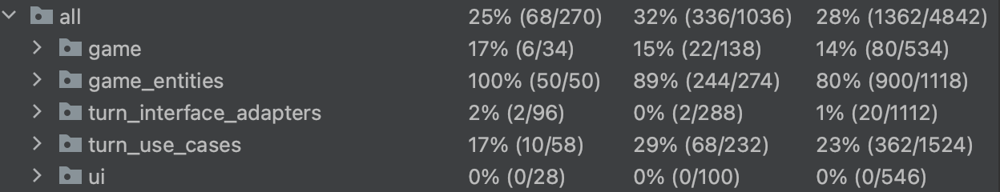

# Monopoly CSC207 Course Project

### by Alireza, Cole, Joshua, Tahir, Qingyu, Yanbo, Youssef

Recreation of the game Monopoly using Java Swing in Java 11 for the CSC207 Fall 2022 Course Project at the University of
Toronto.

Implemented with the Clean Architecture and SOLID design principles.

## Design Process:

After creating CRC cards to help identify the major classes required, a UML chart was made. This chart helps understand the relationship between the classes, interfaces and abstrac classes. The chart also clearly differentiates between Entities, Use Cases, Inreface Adapters and Frameworks/Drivers. After finishing the UML chart, implementation began.
The Tile Entities were the first elements to get implemented (two abstract classes, one for Tile and one for Property and nine different tiles). 
After finishing the Tiles, the implementation of the Use Cases began (eight Use Cases each having their own input/output boundary inrerfaces)
After finishing the Use Cases, each team member implemented the presenter for the Use Case they implemented. 
There are many more implementations that are not listed above (such as GameState, Turn, Card, Player, Save, Load...), feel free to look at the JDocs for more information on these!
## Build & Run Instructions:

WIP

## Test Coverage 
  
  The reason for the low test coverage percentage is that the user interface cannot really be tested using tests.
  Other than the UI, all of the complex (methods that are not getters/setters or easy to implement are not tested) are tested thoroughly thanks to more     than one hundred tests. 

## Sample Images

### Monopoly Board

<!--
NOTE:
  IntelliJ is complaining that the original images are whatever length and that width should be set to that value,
  but we are purposefully downsizing the image here.
-->

  

### Property Title Deeds

  
  

## Asset Credit

Images in [src/main/resources/assets](./src/main/resources/assets) created by Joshua @JLenander with additional
modified Icons:

- <a href="https://iconscout.com/icons/light-bulb" target="_blank">Light Bulb Icon</a>
  by <a href="https://iconscout.com/contributors/ferdizzimo" target="_blank">Ferdizzimo</a>
  on <a href="https://iconscout.com">IconScout</a>
- <a href="https://www.flaticon.com/free-icons/railway" title="railway icons">Railway icons created by Cuputo -
  Flaticon</a>
- <a href="https://www.flaticon.com/free-icons/chest" title="chest icons">Chest icons created by Freepik - Flaticon</a>
- <a href="https://iconscout.com/icons/water-tap" target="_blank">Water Tap Icon</a>
  by <a href="https://iconscout.com/contributors/elmirag" target="_blank">Elmira Gokoryan</a>
  on <a href="https://iconscout.com">IconScout</a>
- <a href="https://iconscout.com/icons/police-badge" target="_blank">Police badge Icon</a>
  by <a href="https://iconscout.com/contributors/max-icons">Maxicons</a> on <a href="https://iconscout.com">
  IconScout</a>
- <a href="https://www.flaticon.com/free-icons/monopoly" title="monopoly icons">Monopoly icons created by Smashicons -
  Flaticon</a>
- <a href="https://www.flaticon.com/free-icons/dollar-bill" title="dollar-bill icons">Dollar-bill icons created by
  juicy_fish - Flaticon</a>
- <a href="https://www.flaticon.com/free-icons/dice" title="dice icons">Dice icons created by vectorsmarket15 -
  Flaticon</a>
- <a href="https://www.flaticon.com/free-icons/jail" title="jail icons">Jail icons created by Dreamstale - Flaticon</a>
- <a href="https://www.flaticon.com/free-icons/vessel" title="vessel icons">Vessel icons created by Vectoricons -
  Flaticon</a>
- <a href="https://www.flaticon.com/free-icons/iron" title="iron icons">Iron icons created by Freepik - Flaticon</a>
- <a href="https://www.flaticon.com/free-icons/sewing" title="sewing icons">Sewing icons created by Freepik -
  Flaticon</a>
- <a href="https://www.flaticon.com/free-icons/car" title="car icons">Car icons created by Freepik - Flaticon</a>
- <a href="https://www.flaticon.com/free-icons/shoes" title="shoes icons">Shoes icons created by Izwar Muis -
  Flaticon</a>
- <a href="https://www.flaticon.com/free-icons/top-hat" title="top-hat icons">Top-hat icons created by iconixar -
  Flaticon</a>
- <a href="https://www.flaticon.com/free-icons/dog" title="dog icons">Dog icons created by Icongeek26 - Flaticon</a>
- <a href="https://www.flaticon.com/free-icons/wheelbarrow" title="wheelbarrow icons">Wheelbarrow icons created by
  Freepik - Flaticon</a>
- <a href="https://www.flaticon.com/free-icons/monopoly" title="monopoly icons">Monopoly icons created by Freepik -
  Flaticon</a>
