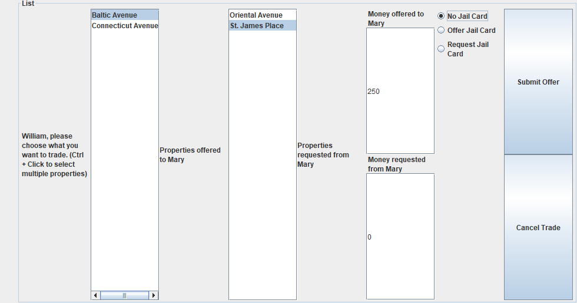

# Monopoly CSC207 Course Project

### by Alireza, Cole, Joshua, Tahir, Qingyu, Yanbo, Youssef

Recreation of the game Monopoly using Java Swing in Java 11 for the CSC207 Fall 2022 Course Project at the University of
Toronto.

Implemented with the Clean Architecture and SOLID design principles.

Includes save/load capabilities with serialization/deserialization of the GameState object.

## Build & Run Instructions:

- Ensure you are using Java 11. We built and tested this with AdoptOpenJDK Version 11.0.9
- Run the Main Method in [Main.java](./src/main/java/Main.java).

## Design Process:

After creating CRC cards to help identify the major classes required, a UML chart was made. This chart helps understand
the relationship between the classes, interfaces and abstract classes.
The chart also clearly differentiates between Entities, Use Cases, Interface Adapters and Frameworks/Drivers. After
finishing the UML chart, implementation began.

The [Tile Entities](./src/main/java/game_entities/tiles) were the first elements to get implemented (two abstract
classes, one for Tile and one for Property and nine different tiles).
We made an inheritance hierarchy where each Tile Would be accessed through a generic Tile interface (primarily
the `Tile.action()`) method
and each type of tile would implement the specific behavior and return a data object `TileActionResultModel` with what
happened. During this phase
we also developed the other [game entities](./src/main/java/game_entities) (Player and Board).

After finishing the Tiles, the implementation of the [Use Cases](./src/main/java/turn_use_cases) began (eight Use Cases
each having their own input/output boundary interfaces).
Each "Turn Use Case" corresponds to an action that the player can choose to take on their turn (ex. roll dice to move,
mortgage properties).
We use dependency injection here where each of the use cases implement their specific Use Case's InputBoundary and take
in an OutputBoundary for their presenter.

The [Turn Controller](./src/main/java/turn_interface_adapters/TurnController.java) is the primary controller object that
acts as a facade for all use case methods that need to be called with user inputs. We use dependency injection with the
use case
input boundaries here to keep the clean architecture.

[Game State](./src/main/java/game/GameState.java) is an entity that contains the other Game Entities, handles Turn
Order, and is
the object that is saved when saving or loading a game.

[UI classes](./src/main/java/ui) define the Views for three different windows. We create a default/blank game view
layout in the
[GameView class](./src/main/java/ui/GameView.java) which is then modified by the presenters to have the appropriate text
or buttons
or other elements depending on the data passed to the presenters.

There are a few more classes that are not listed above, feel free to look at the JDocs for more information on these!

## Test Coverage

Shown below is the automatic test coverage generated by Intellij. We have tests for 100% of our Game Entities with a
decreasing amount of tests as we get to outer layers in the clean architecture.

  

It appears the reason for the low test coverage percentage is that the UI Classes all have references to other classes
and objects (Such as Java awt/Swing elements like JFrames, JPanels or other classes like TurnController which is present
in every Presenter object). For instance, the game package does not have 34 classes in it (it has 5 + 2 interfaces)
but Intellij is seeing 34. We also are not testing any of the visual elements as we can manually test those. Other than
the UI, the complex (methods that are not getters/setters are not tested) are tested thoroughly thanks to more than one
hundred tests.

## Sample Images

### Game Screen (with Inventory screen open)

### Trade Menu

### Monopoly Board

<!--
NOTE:
  IntelliJ is complaining that the original images are whatever length and that width should be set to that value,
  but we are purposefully downsizing the image here.
-->

  

### Property Title Deeds

  
  

## Asset Credit

Images in [src/main/resources/assets](./src/main/resources/assets) created by Joshua @JLenander with additional
modified Icons:

- <a href="https://iconscout.com/icons/light-bulb" target="_blank">Light Bulb Icon</a>
  by <a href="https://iconscout.com/contributors/ferdizzimo" target="_blank">Ferdizzimo</a>
  on <a href="https://iconscout.com">IconScout</a>
- <a href="https://www.flaticon.com/free-icons/railway" title="railway icons">Railway icons created by Cuputo -
  Flaticon</a>
- <a href="https://www.flaticon.com/free-icons/chest" title="chest icons">Chest icons created by Freepik - Flaticon</a>
- <a href="https://iconscout.com/icons/water-tap" target="_blank">Water Tap Icon</a>
  by <a href="https://iconscout.com/contributors/elmirag" target="_blank">Elmira Gokoryan</a>
  on <a href="https://iconscout.com">IconScout</a>
- <a href="https://iconscout.com/icons/police-badge" target="_blank">Police badge Icon</a>
  by <a href="https://iconscout.com/contributors/max-icons">Maxicons</a> on <a href="https://iconscout.com">
  IconScout</a>
- <a href="https://www.flaticon.com/free-icons/monopoly" title="monopoly icons">Monopoly icons created by Smashicons -
  Flaticon</a>
- <a href="https://www.flaticon.com/free-icons/dollar-bill" title="dollar-bill icons">Dollar-bill icons created by
  juicy_fish - Flaticon</a>
- <a href="https://www.flaticon.com/free-icons/dice" title="dice icons">Dice icons created by vectorsmarket15 -
  Flaticon</a>
- <a href="https://www.flaticon.com/free-icons/jail" title="jail icons">Jail icons created by Dreamstale - Flaticon</a>
- <a href="https://www.flaticon.com/free-icons/vessel" title="vessel icons">Vessel icons created by Vectoricons -
  Flaticon</a>
- <a href="https://www.flaticon.com/free-icons/iron" title="iron icons">Iron icons created by Freepik - Flaticon</a>
- <a href="https://www.flaticon.com/free-icons/sewing" title="sewing icons">Sewing icons created by Freepik -
  Flaticon</a>
- <a href="https://www.flaticon.com/free-icons/car" title="car icons">Car icons created by Freepik - Flaticon</a>
- <a href="https://www.flaticon.com/free-icons/shoes" title="shoes icons">Shoes icons created by Izwar Muis -
  Flaticon</a>
- <a href="https://www.flaticon.com/free-icons/top-hat" title="top-hat icons">Top-hat icons created by iconixar -
  Flaticon</a>
- <a href="https://www.flaticon.com/free-icons/dog" title="dog icons">Dog icons created by Icongeek26 - Flaticon</a>
- <a href="https://www.flaticon.com/free-icons/wheelbarrow" title="wheelbarrow icons">Wheelbarrow icons created by
  Freepik - Flaticon</a>
- <a href="https://www.flaticon.com/free-icons/monopoly" title="monopoly icons">Monopoly icons created by Freepik -
  Flaticon</a>
